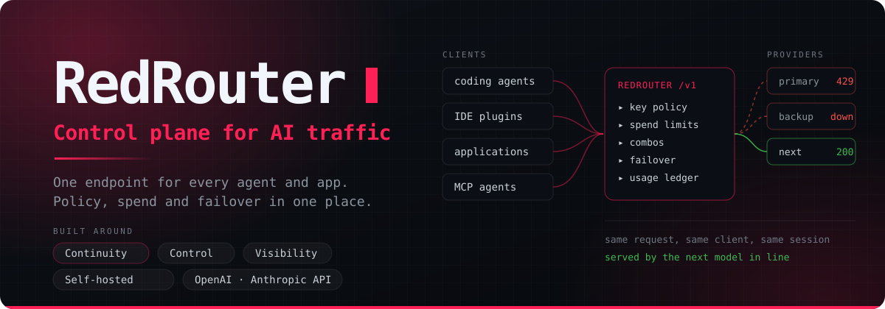
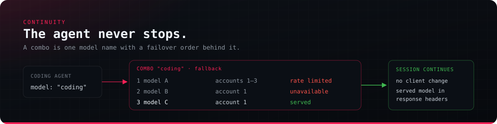
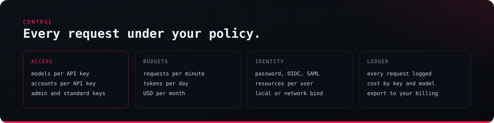

# RedRouter



[](https://www.npmjs.com/package/@reddb-io/red-router)
[](https://github.com/reddb-io/red-router/pkgs/container/red-router)
[](LICENSE)

## Installation

---

RedRouter is a self-hosted control plane for AI model traffic. Coding agents,
IDE plugins and applications send every request to one OpenAI- and
Anthropic-compatible endpoint. RedRouter decides where each request goes,
applies the policy of the API key that sent it, keeps work moving when a
provider fails, and records what every request cost.

You run it: on a laptop, a build server or your own infrastructure. Credentials,
usage records and configuration stay in its local database.

| | |
|---|---|
| **Continuity** | Combos fail over between models and accounts, so an agent keeps working through rate limits, quota exhaustion and outages. |
| **Control** | Per-key model rules, account bindings, request, token and spend limits, admin keys, and SSO for the dashboard. |
| **Visibility** | A ledger of every request, with cost by key, model and provider, quota tracking, and export to your billing system. |
| **Compatibility** | OpenAI Chat Completions and Responses, Anthropic Messages, an MCP server, and white-label branding. |

---

## Continuity: the agent never stops



A long coding session should not end because one provider returned `429` at
the wrong moment. In RedRouter, the agent asks for a **combo**: a single model
name with an ordered set of models behind it.

- **Model failover.** When a member fails, the next one serves the same
  request. A failure can be a rate limit, an exhausted quota, an outage, or an
  error sent inside a successful response. The client sees one uninterrupted
  answer.
- **Account failover.** Each member can be backed by several accounts of the
  same provider. RedRouter moves between them before moving to the next model,
  and prefers the healthiest account when the `health` strategy is selected.
- **Strategies.** `fallback` (a strict order), `round-robin`, and judge-based
  strategies. Parameters such as context size and reasoning levels are
  reconciled across members so a switch does not break the request.
- **One name per model.** With flat model ids (`vendor/model`), RedRouter
  treats every provider that serves the same model as interchangeable offers.
  You set their order, or switch some off, on the Models page.
- **Traceable.** The model that actually served each request is returned in
  response headers and kept in the request log.

## Control: every request under your policy



- **Access.** Each API key can be limited to specific models or combos, and
  bound to specific provider accounts. Admin keys can manage other keys through
  the MCP server; standard keys only call models.
- **Budgets.** Per-key limits on requests per minute, tokens per day and spend
  per month. A key over its limit gets `429` with `Retry-After`.
- **Identity.** The dashboard supports a password, OIDC or SAML single
  sign-on. Resource scoping gives each user their own keys, accounts and combos.
- **Exposure.** RedRouter listens on `127.0.0.1` by default. Opening it to the
  network is an explicit setting, and API keys can be made mandatory.
- **Autopilot (optional).** A small decision model can pick the combo member
  and the reasoning level for each turn. It is off by default, and a test mode
  records what it would do without changing any request.

## Visibility

- **Usage ledger.** Every request is recorded with tokens, cost, latency,
  status and the model that served it. It can be filtered by API key, model and
  provider.
- **Quotas.** For providers that report quotas, the Quota page shows remaining
  capacity per account. Routing can take quotas into account.
- **Export.** Usage can be delivered to a billing or analytics system, either
  per request or as per-key totals every 5 to 60 minutes. Deliveries are made
  by signed webhook, Amazon SQS, Kafka or a RedDB queue, with retries and stable
  delivery ids.
- **Live console.** A filterable, real-time view of the gateway's log.

## Responsible use

RedRouter does not provide access to any model. It forwards requests using the
credentials you supply, and you remain bound by each provider's terms of
service, acceptable-use policies and rate limits. That includes any restrictions
a provider places on using a subscription plan or account through third-party
tools. Connect only accounts you are authorized to use, in the way their terms
allow.

RedRouter is an independent project, not affiliated with or endorsed by any
model provider. Product and company names are trademarks of their respective
owners.

## Get started

Requires Node.js 18 or later.

```bash
npx -y @reddb-io/red-router@latest      # run without installing
npm install -g @reddb-io/red-router     # or install globally
red-router
```

Open `http://localhost:25050/dashboard`, set the dashboard password, connect
a provider account, and create an API key. Then point your client at the
gateway:

```bash
export OPENAI_BASE_URL=http://localhost:25050/v1
export OPENAI_API_KEY=<RedRouter API key>
```

### Run as a service

`systemd --user` on Linux, `launchd` on macOS:

```bash
red-router service install      # listens on 127.0.0.1
red-router service status
red-router service uninstall
```

### Run in a container

```bash
docker run -d --name red-router -p 25050:25050 \
  -e INITIAL_PASSWORD='choose-a-strong-password' \
  -v red-router-data:/data \
  ghcr.io/reddb-io/red-router:latest
```

All state lives in `/data`. A [`docker-compose.yml`](docker-compose.yml) is included.

### Network access

To accept connections from other machines, choose **Whole network** in
Settings → Network access, or run `red-router network lan`
(`red-router network local` switches back). Before you do:

- set a strong dashboard password;
- turn on **Require API key** (Endpoint & Keys);
- issue one API key per client.

## Integrations

| Interface | Details |
|---|---|
| Chat | `POST /v1/chat/completions`, `POST /v1/responses`, `POST /v1/messages` |
| Models | `GET /v1/models`: models and combos with context size, capabilities and reasoning levels |
| Media and data | `/v1/embeddings`, `/v1/images`, `/v1/audio`, `/v1/videos`, `/v1/search`, `/v1/fetch` |
| MCP | `POST /v1/mcp`: models, combos, providers, quotas and usage for the calling key |
| Key discovery | `GET /v1/key`: the calling key's role and where to register the MCP server |

Requests authenticate with `Authorization: Bearer <RedRouter API key>` (or
`x-api-key`). RedRouter supports more than 40 providers, connected with an API key or with the
provider's own sign-in where it offers one. It also supports any OpenAI- or
Anthropic-compatible endpoint, including self-hosted servers and another
RedRouter instance.

**White label.** A single `branding.json` sets the product name, logo, favicon,
login screen and theme. Routing and APIs stay the same.

## Documentation

- [Architecture](docs/ARCHITECTURE.md): request lifecycle, routing, authentication and data model.
- [Guides](gitbook/): setup and frequently asked questions.
- [Changelog](cli/CHANGELOG.md).

## Development

```bash
pnpm install
pnpm dev                         # dashboard and gateway
cd tests && npx vitest run       # test suite
```

Releases use [Changesets](https://github.com/changesets/changesets). A pushed
`vX.Y.Z` tag publishes the npm package and the container image.

## License

[MIT](LICENSE)
