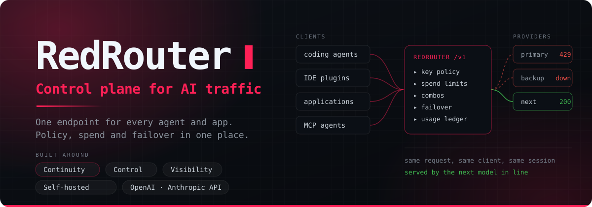
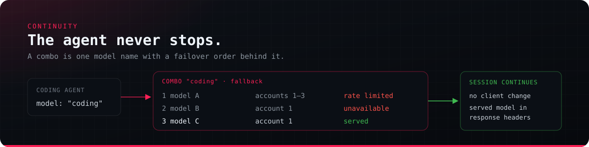

# RedRouter



[](https://www.npmjs.com/package/@reddb-io/red-router)
[](https://github.com/reddb-io/red-router/actions/workflows/red-publish.yml)
[](LICENSE)

RedRouter is a self-hosted control plane for AI model traffic. Coding agents,
IDE plugins and applications connect to one gateway. RedRouter selects providers,
applies API-key policies, handles fallback, and records usage and cost.

RedRouter owns the product: its interface, workflows, configuration contracts,
documentation and release channel. It incorporates and improves capabilities from
[9router](https://github.com/decolua/9router),
[RedRouter](https://github.com/reddb-io/red-router) and
[LiteLLM](https://github.com/BerriAI/litellm).

## Integration status

The current development tree contains a large RedRouter integration. It has **not**
been established as a feature-preserving replacement for RedRouter `v0.33.0`.
The original RedRouter remains the product baseline. Existing upstream-derived
modules are implementation assets; their presence does not establish product parity.

Known gaps in preserving that baseline include the original dashboard experience,
SAML dashboard sign-in, usage-export transports, remote-router
catalog behavior, and the complete legacy client-discovery contract. The
`/v1/key`, `/v1/catalog` and `/v1/capabilities` routes are restored in the working
tree with partial compatibility; CI validation is pending. Some features,
including JEV/System One and white-label branding,
have implementations in the new tree but still require contract-by-contract comparison.
LiteLLM parity has not been established.

The [inheritance inventory](config/upstream/product-inheritance.json) records the
initial capability families, source snapshots, local evidence and unresolved work.
It is not an exhaustive feature list or a percentage-complete claim.

## Continuity



The routing engine supports model and account fallback, circuit breakers,
connection cooldowns, model lockouts and quota-aware selection. Providers and
models must retain their distinct authentication, entitlement and transport
contracts; an alias alone does not make two products equivalent.

Optional JEV decision routing and the separate System One evaluation endpoint
are implemented in the source tree. Their presence does not prove real-provider
availability or complete compatibility with every client.

## Control and visibility

The source tree includes per-key policy enforcement, budgets, usage reporting,
provider quotas, a live console, OIDC dashboard authentication and white-label
configuration. Restoring the RedRouter product experience also requires verifying
these features against their earlier behavior.

Additional upstream capabilities include MCP, A2A, guardrails, caching,
compression, evaluations and multimodal endpoints. Each capability needs an
explicit RedRouter integration and behavioral validation before parity is claimed.

## Install the published RedRouter

The package is `@reddb-io/red-router`; the command is `red-router`.
Check the [release notes](https://github.com/reddb-io/red-router/releases) for the
version you intend to install. A successful upload job alone does not prove npm
registry availability.

```bash
npm install -g @reddb-io/red-router
red-router
```

Installation requirements and defaults differ between the earlier RedRouter and
the current integration. The current source requires Node.js
`>=22.22.2 <23 || >=24.0.0 <27`, as declared in [package.json](package.json).

The CLI restores the RedRouter v0.33 runtime defaults: port `25050`, loopback-only
binding (`127.0.0.1`) and data under `~/.red/router`.

```bash
red-router serve
red-router service install
red-router service status
```

On Linux, service installation also enables a separate `red-router-tray.service`
for the graphical session. The tray attaches to the existing server and survives
unattended package upgrades. It reports readiness after registering with the
desktop, restarts after a helper failure, and keeps its diagnostics in the journal.
`red-router service status` reports server and tray state separately, including
whether the tray is registered. Desktop autostart supplies the session environment;
headless installations wait for a desktop login. Set `RED_ROUTER_TRAY=0` when
installing the service to disable the tray.

```bash
red-router tray start
journalctl --user -u red-router-tray.service
```

Use `--host 0.0.0.0` or `--expose` only when network access is intentional and
the inference API is protected. The inherited `OMNIROUTE_*` environment variables
remain compatibility aliases; new RedRouter configuration should prefer
`RED_ROUTER_*` names where available.

## API surfaces

These route implementations are present in the current source. Protocol and
provider parity must be verified separately.

| Interface           | Route                                   |
| ------------------- | --------------------------------------- |
| OpenAI chat         | `POST /v1/chat/completions`             |
| OpenAI Responses    | `POST /v1/responses`                    |
| Anthropic Messages  | `POST /v1/messages`                     |
| Model discovery     | `GET /v1/models`                        |
| Key discovery       | `GET /v1/key`                           |
| Grouped catalog     | `GET /v1/catalog`                       |
| Client capabilities | `GET /v1/capabilities`                  |
| Embeddings          | `POST /v1/embeddings`                   |
| System One          | `POST /v1/systemone` or `/v1/decisions` |
| MCP                 | `/v1/mcp`                               |
| Audio translation   | `POST /v1/audio/translations`           |

The product UI and CLI are English-only. Translation APIs are separate product
features and remain in scope.

### Client discovery compatibility

`GET /v1/key` requires a valid persisted API key. It returns only public key
identity, role, configured model-ID preference, and the loopback-only legacy MCP
endpoint metadata. Environment-only keys are not persisted MCP tenants and receive
401 here. Bearer, `x-api-key`, and `x-goog-api-key` header credentials are accepted;
URL credentials are not.

`GET /v1/catalog` groups the existing authorized `/v1/models` data by `owned_by`,
separating combo and alias entries without rewriting their routable IDs. It uses
the same catalog access policy, but always rejects an explicitly invalid key.
`GET /v1/capabilities` reports the same scoped System One model IDs, public routing
strategies and combo-scoped decision hints. Listing a System One model is not a
live availability check; its availability is explicitly `not_probed`.

Both documents accept only the optional `for` client label and `variants=expand`.
Pagination, other filters and collapsed variants return 400 instead of silently
producing an incomplete discovery document. Responses are private and not cached.
Their opaque catalog version hashes the authorized entries, excluding generated
`created` timestamps; it is not the legacy shared `/v1/models` version header.

This is a partial restoration, not complete v0.33.0 compatibility. Recommendations,
account metadata, collapsed variants, per-key ID-format application to model lists,
stable instance identity, and the old global reasoning/session discovery fields
remain pending. `/v1/key` reports the stored ID-format preference; it does not imply
that `/v1/models` or `/v1/catalog` already applies that preference.

### Remote router catalogs

The `red-router` provider now discovers directly served chat models from a remote
`/v1/models` endpoint and persists them per connection. The cache is bound to both
the remote URL and its API key. Discovery preserves qualified IDs such as
`cc/claude-example`, retains a saved catalog during an outage, and refuses to write
a response if the connection was deleted or its credentials changed during the fetch.

Automatic discovery is the default for this provider; explicit `autoFetchModels:
false` and `autoSync: false` settings remain respected. Reads refresh after five
minutes; background refresh uses the existing model-sync scheduler's interval.
These changes are local and still await CI. Multi-hop federation, remote System
One and migration of the older embedded cache/proxy settings remain pending.
Discovery uses the current connection-level proxy resolver; unsupported legacy
proxy settings fail closed. Typed non-chat and re-exposed router entries are not
imported as chat.

### Release ownership

RedRouter publishes `@reddb-io/red-router` from `reddb-io/red-router` using
`.github/workflows/red-publish.yml`. Changesets are the intended versioning policy,
and the workflow never chooses or rewrites a version. It validates pull requests and
main, then publishes only an existing SemVer tag whose package version was prepared
from `.changeset` files. The exact tarball tested by the tag run is promoted to npm
and attached to its GitHub Release. See
[the workflow review](docs/ops/REDROUTER_WORKFLOW_REVIEW.md). No feature-parity or
successful-release claim follows from the presence of a route, workflow, or
inherited test.

## Persistence and scale

SQLite is the initial local backend. Some runtime coordination has optional Redis
implementations. That does not make the whole gateway safe to run as a cluster.

Shared durable storage, atomic budgets, distributed leases, idempotent usage
accounting and migration ownership require explicit implementation and
multi-replica validation. PostgreSQL/replica support is an integration objective,
not a claim about the current release.

## Development and validation

```bash
npm ci
npm run dev
npm run build:release
```

The development server uses port `25050`. See
[CONTRIBUTING.md](CONTRIBUTING.md) for the test suites.

For the current integration work, validation runs through GitHub Actions.
Coverage percentages are not a release gate. Release validation must cover the
RedRouter contracts as well as upstream features, the packed artifact, registry
availability and the published installation.

## Documentation and provenance

- [Architecture](docs/architecture/ARCHITECTURE.md)
- [Existing 9router/OmniRoute assessment](docs/architecture/UPSTREAM_PARITY_ASSESSMENT.md)
- [Capability inheritance inventory](config/upstream/product-inheritance.json)
- [Changelog](CHANGELOG.md)
- [Third-party notices](THIRD_PARTY_NOTICES.md)

Upstream attribution and applicable licenses are preserved. Reusing an upstream
implementation does not transfer ownership of RedRouter's product direction to
that upstream. LiteLLM's enterprise directory has separate licensing; functional
requirements must be distinguished from permission to copy an implementation.
